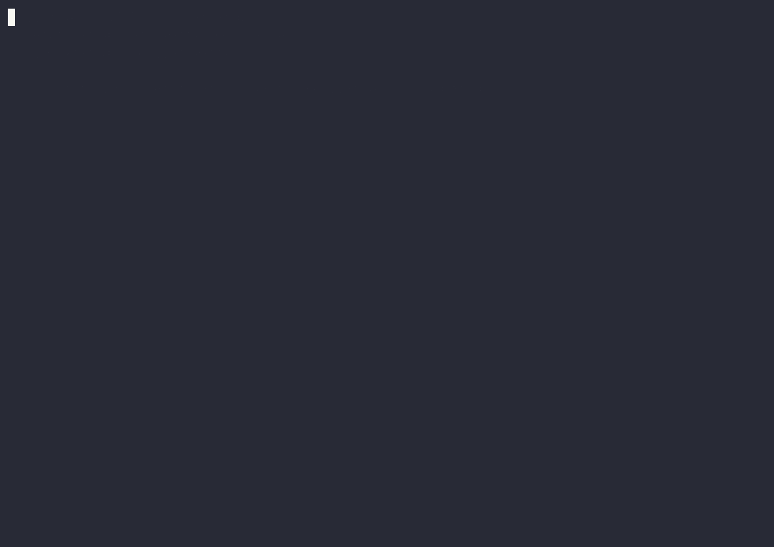
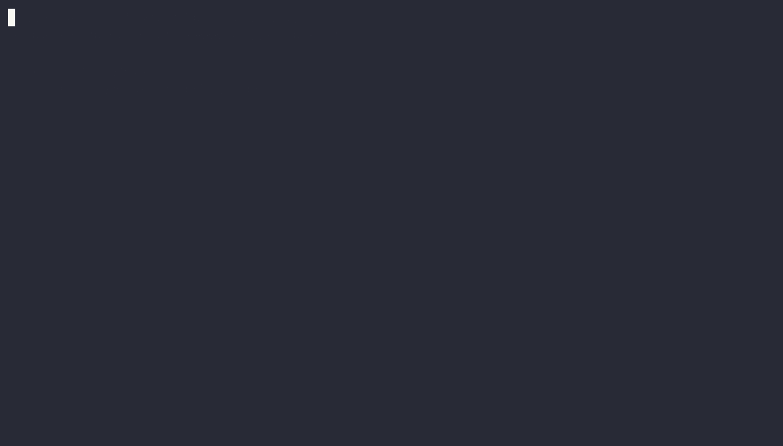
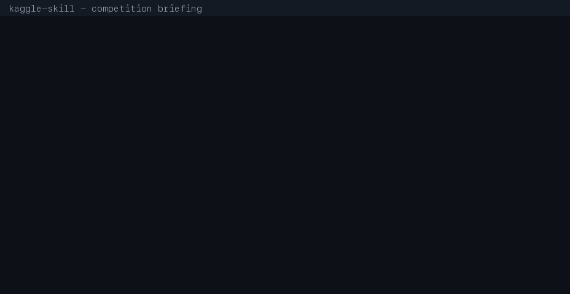

# Screencasts

Short terminal casts are kept here as replayable `.cast` files. GitHub cannot
play raw asciinema files inline, so generated GIF previews live in `media/` and
are embedded in Markdown. The `.cast` files remain the source of truth.

## Watch Order

### Claude Install And First Workflow



Source: [install-and-demo.cast](install-and-demo.cast)

### ARC-AGI Top Writeups


Source: [arc-agi-top-writeups.cast](arc-agi-top-writeups.cast)

### Antigravity CLI Install


Source: [antigravity-install.cast](antigravity-install.cast)

### Antigravity MCP Config



Source: [mcp-config.cast](mcp-config.cast)

### Competition Briefing



Source: [competition-brief.cast](competition-brief.cast)

### Hackathon Writeups


Source: [hackathon-writeups.cast](hackathon-writeups.cast)

### Codex Install


Source: [codex-install.cast](codex-install.cast)

Replay any source cast with:

```bash
asciinema play docs/demo/competition-brief.cast
```

Render a GIF preview with:

```bash
agg docs/demo/competition-brief.cast docs/demo/media/competition-brief.gif
```

If `agg` is unavailable, install it with `cargo install --locked agg` or use
the package manager documented by the asciinema/agg project.

## Recording Notes

- Keep each cast focused on one workflow and under about 90 seconds.
- Re-record or hand-clean any cast that includes terminal escape/control
  sequences from progress spinners, cursor movement, or alternate screens.
- Prefer redacted, deterministic output over long live API payloads.
- Do not print tokens, credential file names, credential JSON, or environment
  assignments that include secrets.
- Re-render GIF previews after editing a cast.
- Re-run `python3 -m pytest tests/manifest/test_docs_freshness.py -q` before
  committing any cast.

See [demo-script.md](demo-script.md) for the main README demo command sequence
and cast-specific recording plans.
