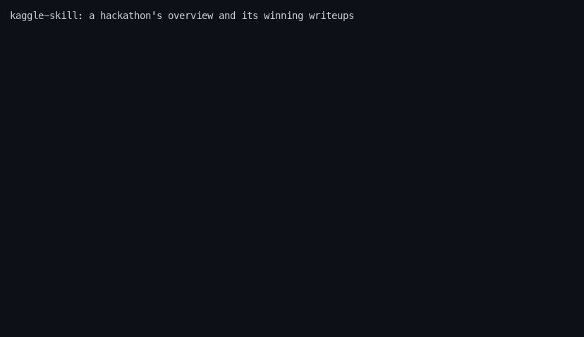
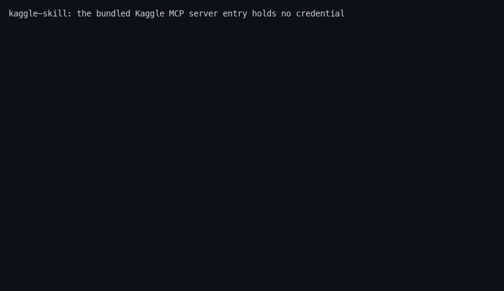
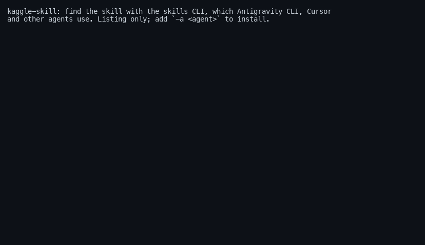

# Screencasts

Short terminal casts of the skill at work. The `.cast` files are the source;
GitHub cannot play them inline, so each has a GIF in `media/`.

The casts are built from real command output by `tools/build_casts.py`. They
are not recordings of an agent session: they show the commands an agent runs
and what comes back. Colour codes are removed, long output is cut with a line
that says how much was left out, and temporary folder paths are shortened.
Nothing else is edited.

## Solution writeups of the top teams


Source: [vesuvius-top-writeups.cast](vesuvius-top-writeups.cast)

## Claude Code install and first workflow


Source: [install-and-demo.cast](install-and-demo.cast)

## Competition briefing


Source: [competition-brief.cast](competition-brief.cast)

## Hackathon writeups



Source: [hackathon-writeups.cast](hackathon-writeups.cast)

## Kaggle MCP server entry



Source: [mcp-config.cast](mcp-config.cast)

## Codex install


Source: [codex-install.cast](codex-install.cast)

## Antigravity CLI and skills.sh



Source: [antigravity-install.cast](antigravity-install.cast)

## Replay

```bash
asciinema play docs/demo/competition-brief.cast
```

## Rebuild

```bash
python3 tools/build_casts.py
python3 tools/build_casts.py competition-brief
python3 tools/build_casts.py --gif-only
```

The builder needs the Kaggle CLI, Pillow, and a Kaggle credential for the
roster and forum steps. Casts that use `claude`, `codex`, `agy`, or `npx` are
skipped when that program is missing. Plugin installs run in throwaway config
folders, from the local checkout, so the casts can be rebuilt before a
release is on GitHub. See [demo-script.md](demo-script.md) for what each cast
runs.

After a rebuild, run `python3 -m pytest tests/manifest -q`. The tests check
that no cast contains a credential, a control sequence, or stale module paths.
