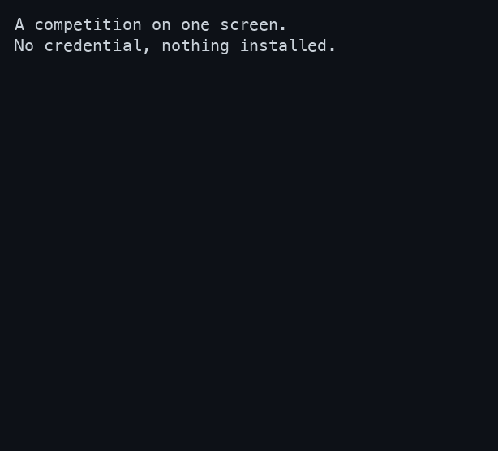
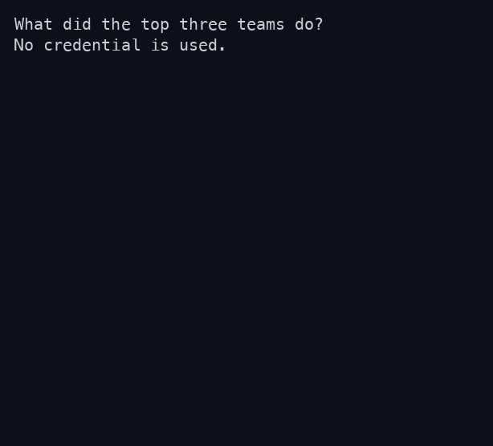
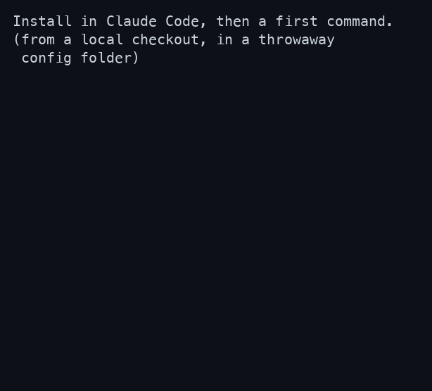
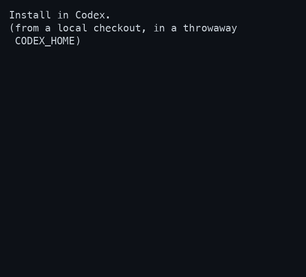

# Demos

Short demos of the skill at work. Each has a `.cast` file (asciinema) and a
GIF in `media/`, because GitHub cannot play casts inline.

There are two kinds, and each says which it is:

- **A recorded agent session** is a real Claude Code session, kept as a JSON
  file in `sessions/`: the question, the commands the agent ran with the
  start of what they printed, and the agent's answer, none of it reworded.
  Rebuilding it runs nothing.
- **A command demo** runs the skill's commands when it is built and keeps
  their output. It shows what an agent runs and what comes back; no agent
  takes part.

In both, colour codes are removed, long output is cut with a line that says
how much was left out, temporary folder paths are shortened, and a block's
opening tag is shown without its attributes (`<untrusted-content-1a2b3c4d …>`)
so that it fits on one row. In a session the agent's answer is drawn as a
terminal shows prose: Markdown marks are left out, a link shows as its text,
and a long answer is shown a screen at a time with time to read each one.
Nothing else is edited. Both kinds run with no Kaggle credential, so they show what anyone
gets and nothing about an account. A session keeps only the lines of each
output that the demo shows: the rest is other people's writing.

The screen is 48 columns wide. GitHub shrinks an image to a phone's width,
and at 48 columns the type is still about 11 pixels tall.

## A question about a competition

Recorded agent session: [sessions/agent-brief.json](sessions/agent-brief.json).

> What's the deadline and the metric of kaggle.com/competitions/arc-prize-2026-arc-agi-3?


Source: [agent-brief.cast](agent-brief.cast)

## A submission is a dry run first

Recorded agent session: [sessions/agent-submit.json](sessions/agent-submit.json).
The agent checks the file, shows the dry run, and asks before it submits.

> Submit ./submission.csv to the Titanic competition on Kaggle.


Source: [agent-submit.cast](agent-submit.cast)

## What the top teams did

Recorded agent session: [sessions/agent-solutions.json](sessions/agent-solutions.json).
The GIF shows the start of the answer; the file has all of it.

> What did the top three teams of Kaggle's ARC Prize 2025 do? A few lines each.


Source: [agent-solutions.cast](agent-solutions.cast)

## A competition on one screen

Command demo.



Source: [competition-brief.cast](competition-brief.cast)

## Solution writeups of the top teams

Command demo.



Source: [vesuvius-top-writeups.cast](vesuvius-top-writeups.cast)

## Claude Code install and first command

Command demo.



Source: [install-and-demo.cast](install-and-demo.cast)

## Codex install

Command demo.



Source: [codex-install.cast](codex-install.cast)

## Replay

```bash
asciinema play docs/demo/agent-brief.cast
```

## Rebuild

```bash
python3 tools/build_casts.py
python3 tools/build_casts.py competition-brief
python3 tools/build_casts.py --gif-only
python3 tools/build_casts.py --readme
```

The builder needs Pillow, and `claude` and `codex` on the PATH for the two
install demos; a demo whose program is missing is skipped. Plugin installs
run in throwaway config folders, from the local checkout, so the demos can be
rebuilt before a release is on GitHub. `--readme` also refreshes the demo
blocks in the repository's README. See [demo-script.md](demo-script.md) for
what each demo runs and how a session is recorded.

After a rebuild, run `python3 -m pytest tests/manifest -q`. The tests check
that no cast contains a credential, a control sequence, or stale paths, and
that each cast is short.
